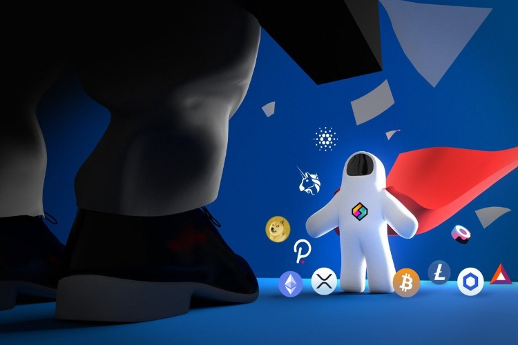

LBRY, THE SEC, & THE FUTURE OF CRYPTO

# [Boi News](https://the-boi-group.github.io/TheBoiGroup/)

Content: **Technology**

****

SEC has a new legislation that would  make almost any token a security, including the previously safe Ethereum. The nature of technology is that it is never "finished".

LBRY.tv and Odysee (There by the same company "LBRY INC") is basically YouTube but better you see people getting demonised for swearing in the 30 seconds of there video or trying to trick the algorithm for favouring them. With LBRY.tv and Odysee none of this is a issue.
This change will make it much harder for startups to form new block chain companies. This is return would cause job losses and "Stunt development"

Please Help LBRY By signing this [petition.](https://www.change.org/p/u-s-securities-and-exchange-commission-cryptocurrency-is-not-a-crime)

Or share using this  hashtag: [#HelpLBRYSaveCrypto](https://twitter.com/intent/tweet?text=LBRY%20and%20cryptocurrencies%20are%20useful%20technologies%20that%20must%20remain%20legal%20and%20free%20%23HelpLBRYSaveCrypto%0A%0Awww.helplbrysavecrypto.com)